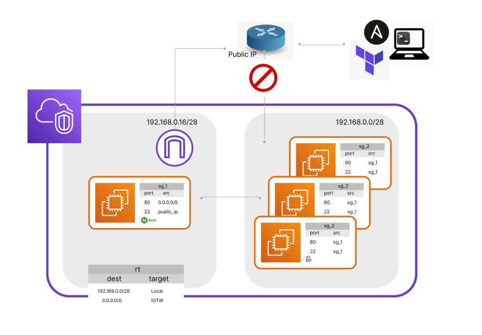

<h1>Objetivo</h1>

Automatizar o provisionamento e configuração dos recursos.

 
<h1>Ferramentas</h1>

- Bash shell
- Terraform
- Ansible
- Nginx

 
<h1>Desafios</h1>

- Garantir o minimo de permissão possivel para atingir o objetivo por meio de camada de internet e transporte.

- Garantir que o Ansible acesse e configure os servidores na subrede privada a partir de um jumper, no caso, o servidor de Proxy.

- Criação do script de automação.

 
<h1>Arquitetura</h1>

- 1 vpc (192.168.0.0/24).
- 2 subredes (192.168.0.0/28 & 192.168.0.16/28).
- 1 internet gateway.
- 1 ipv4 elastíco público.
- 1 tabela de Roteamento.
- 4 instancias ec2 (proxy e 3 servidores http).
- 2 grupos de Segurança.

 
<h1>Demo - Execução e cURL</h1>
<h3>Construindo e Configurando a Infraestrutura</h3>
<video width="640" height="360" controls>
  <source src="./ref/webm/Demo-Terraformar.webm" type="video/mp4">
  Your browser does not support the video tag.
</video>

[Watch the demo](./ref/webm/Demo-Terraformar.webm)
[Watch the demo](/ref/webm/Demo-Terraformar.webm)

 
<h1>Demo - Destruindo a Infraestrutura</h1>
<h3>Terraform Destroy</h3>
<video width="640" height="360" controls>
  <source src="./ref/mp4/demo-desterraformar.mp4" type="video/mp4">
  Your browser does not support the video tag.
</video>

 
<h1>Demo - LB no Navegador</h1>
<video width="640" height="360" controls>
  <source src="./ref/mp4/demo-gui.mp4" type="video/mp4">
  Your browser does not support the video tag.
</video>

 
<h1>Nota</h1>
Os seguintes arquivos e caminhos são construídos a partir do script shell e estão contidos nesse repositório apenas para demonstração:
  

- /home/{user}/.ssh/config
- ./ansible/inventory.ini
- ./ansible/playbook.yml

Variaveis de ambiente AWS foram exportadas.
  